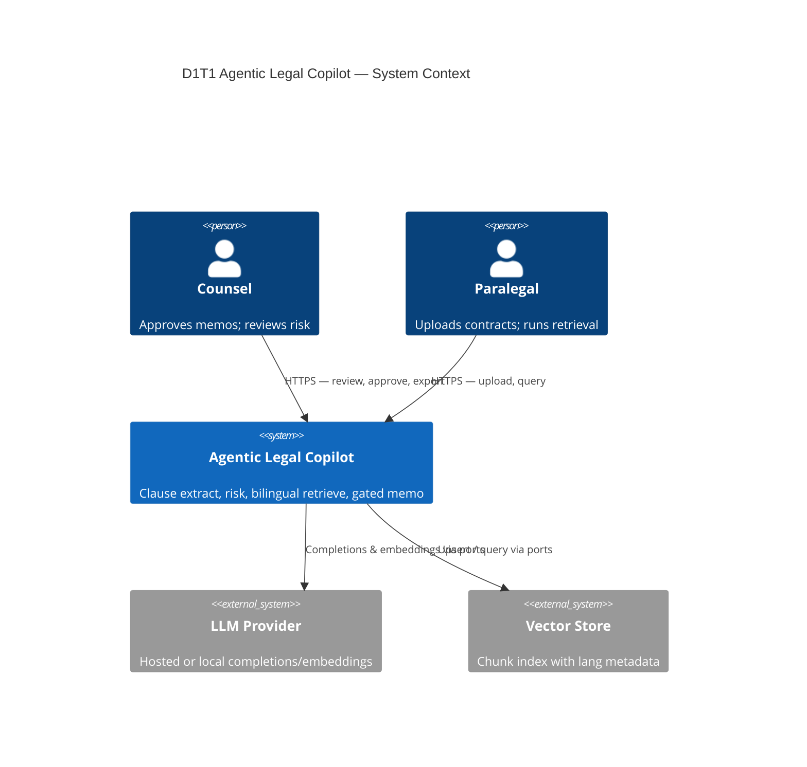
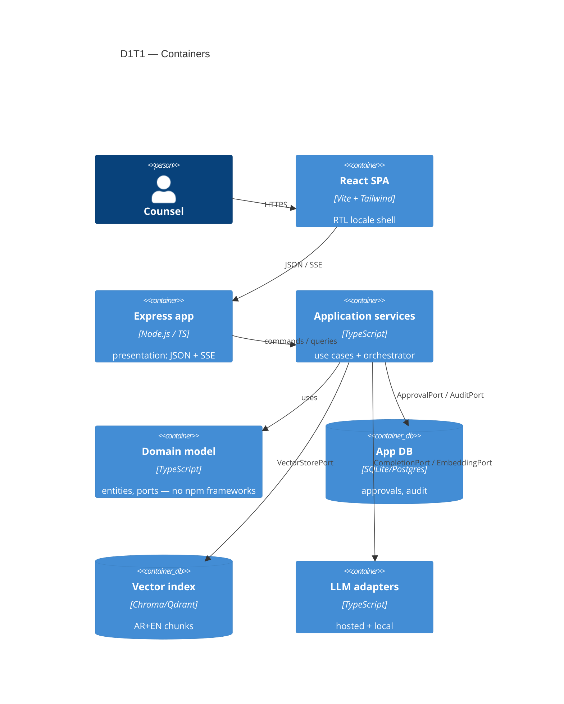
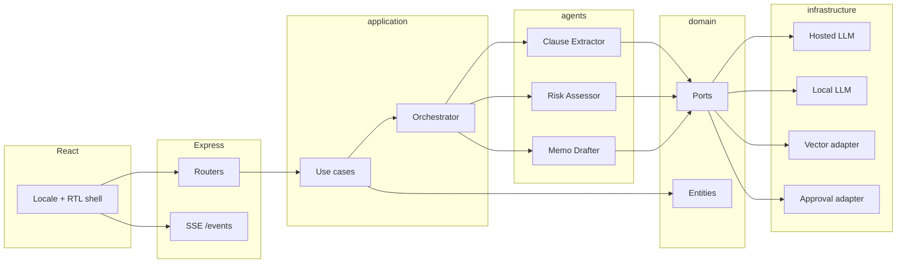
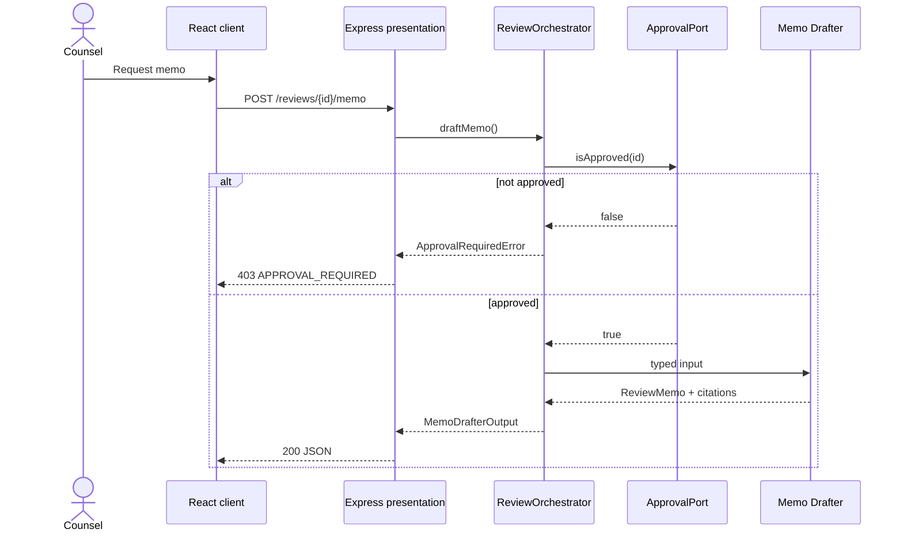

# Architecture

**Style:** Strict Clean / Hexagonal (ports & adapters)  
**Runtime (target):** Node.js 20+, Express, React + Vite  
**Variant:** D1T1

Inner layers (`server/src/domain`, `server/src/application`) **must never** depend on LLM SDKs, vector databases, or web frameworks. See `.cursorrules`.

---

## 1. C4 — Context (Level 1)



**Placeholder:** Replace this sketch with a reviewed Context diagram (PNG or updated Mermaid) before the assessment demo.

---

## 2. C4 — Container (Level 2)



**Placeholder:** Add a Container diagram that names real adapters once they exist.

---

## 3. C4 — Component (Level 3)



**Placeholder:** Component diagram should show **typed schemas** on each agent boundary (see `server/src/application/agents/schemas.ts`).

---

## 4. Sequence — Counsel-gated memo (target)



**Placeholder:** Add extract/assess sequences when those routes exist. Scaffold today: memo route always 403 until an approval adapter records the review id (in-memory, empty on boot).

---

## 5. C4 — Code (Level 4)

**Placeholder.** After the first vertical slice, document `draftMemo` end-to-end:

- `presentation` DTO → `application` command
- `ApprovalPort.isApproved()`
- Memo Drafter input/output schema
- `CompletionPort.complete()`
- citation validator in `domain`

Link to source files here when they exist. Current entrypoints:

- `server/src/main.ts`
- `server/src/presentation/http/app.ts`
- `server/src/application/orchestrator.ts`
- `server/src/domain/ports/*.ts`

---

## 6. Architecture Decision Records

Keep ADRs short: context, decision, consequences. Four records are required for this assessment.

### ADR-0001 — Hexagonal architecture with Express at the edge

| Field | Content |
| --- | --- |
| Status | Proposed |
| Context | Assessment requires Clean/Hexagonal architecture; Express is the HTTP framework; React is a separate SPA. |
| Decision | Domain and application contain no Express/LLM/vector imports. Express lives only in `server/src/presentation`. React lives only in `client/`. |
| Consequences | Slightly more types/ports early; use cases testable without spinning HTTP. |

### ADR-0002 — Provider abstraction for completions, embeddings, and tools

| Field | Content |
| --- | --- |
| Status | Proposed |
| Context | Hosted APIs may be unavailable; models will change. |
| Decision | `CompletionPort`, `EmbeddingPort`, and (later) tool ports in domain; hosted and local adapters in infrastructure, selected by `LLM_PROVIDER`. |
| Consequences | Factory in infrastructure; domain tests use fakes. |

### ADR-0003 — Three typed agents plus orchestrator; Counsel HITL on side effects and memo

| Field | Content |
| --- | --- |
| Status | Proposed |
| Context | Unbounded “one agent with tools” is hard to evaluate and easy to over-act. |
| Decision | Clause Extractor, Risk Assessor, Memo Drafter, coordinated by `ReviewOrchestrator` via typed schemas. Memo drafting and side effects require Counsel approval (`ApprovalRequiredError` → HTTP 403). |
| Consequences | More hops per review; clear eval surfaces per agent; no silent exports. |

### ADR-0004 — Bilingual AR+EN with RTL presentation and cross-lingual retrieval

| Field | Content |
| --- | --- |
| Status | Proposed |
| Context | Twist T1. Monolingual RAG fails Counsel who work in both languages. |
| Decision | Tag every chunk and clause with `language`. Use a multilingual embedding space (or dual encode). The React app sets `dir="rtl"` for `ar`. Translations are labeled, never silently substituted for source text. |
| Consequences | Need bilingual golden set and RTL checks; embedding model choice is coupled to the index. |

---

## 7. Dependency rule (enforcement)

```
client → presentation → application → domain ← infrastructure
```

Forbidden:

- `server/src/domain/**` importing `express`, `openai`, vector clients, etc.
- `server/src/application/**` doing the same.

**Placeholder:** Add `dependency-cruiser` or an ESLint boundary rule in a later step.
